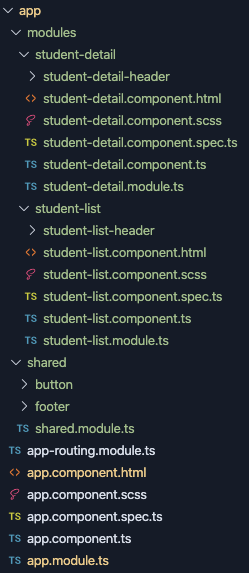
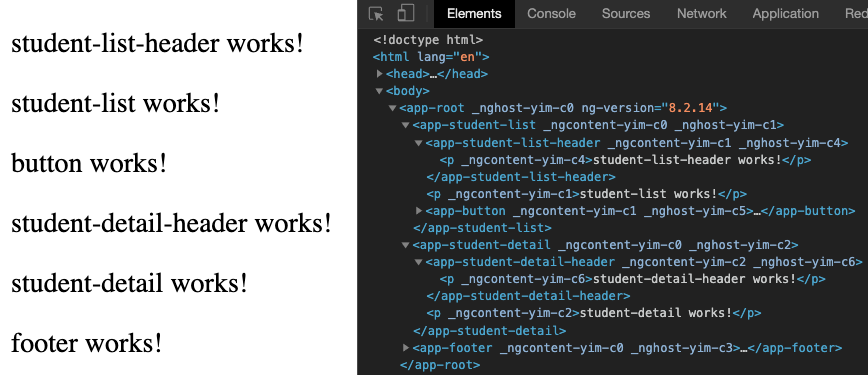

# Día 1 - Angular | Ejercicios

Igual que hicimos con el otro bloque de ejercicios, vamos a clonarnos el repositorio con los ejercicios de Angular de esta primera sesión.

La URL con los ejercicios es: **TODO** 

Debemos crearnos una rama con nuestro nombre `angular-sesion-1_Nombre_Apellido`. Y trabajar sobre dicha rama, para subirla a GitLab y solicitar una *Pull Request* (*Merge Request*) a `master`.

En este caso encontraremos un proyecto angular iniciado (muy similar al que tendremos en local, si hemos seguido todos los pasos del temario). Debemos de completar el proyecto con los artefactos requeridos, y luego subirlo a GitLab.

Vamos a completar el proyecto Angular iniciado con algunos módulos y componentes.

### Módulo compartido

Vamos a generar un nuevo módulo, pero en este caso no será un módulo asociado a la vista de estudiantes o a su detalle. Será un módulo **compartido** ¿y para qué? Pues para incluir ahí dentro todos los componentes que serán comunes de nuestra aplicación.

Genera un módulo llamado `shared` en el directorio `app/shared`, e impórtalo en el módulo principal de nuestra aplicación.

Ahora enriquece el nuevo **shared.module.ts** con los módulos generales `FormsModule` y `ReactiveFormsModule`. Recuerda incluirlos en los arrays de **importación** (para poder hacer uso de ellos) y de **exportación** (para que puedan hacer uso otros módulos de nuestra aplicación).

### Componente compartido

Ahora que ya tenemos un módulo compartido, podemos generar nuestro primer componente compartido. Vamos a crear un componente botón, común a toda nuestra aplicación.

Genera un componente `button` en la carpeta `app/shared`, y asegúrate de exportarlo en el módulo compartido, para que lo puedan usar los otros módulos de la aplicación.

Ahora declara `<app-button>` en el template del módulo `student-list`, y comprueba que hayas importado el módulo de shared en tu **student-list.module.ts**, sino Angular no sabe dónde buscar este nuevo botón.

### Completa el módulo student-detail

Perfecto, ahora vamos a completar nuestra aplicación añadiendo contenido al módulo **student-detail**. Deberas generar los siguientes componentes:

- Componente padre `student-detail`
- Componente hijo `student-detail-header`
- Componente compartido `footer` en la carpeta shared

Para poder visualizarlo todo, establece el otro componente `<app-student-detail>` debajo del `<app-student-list>` en el **app.component.html**. Y debajo de ambos, el `<app-footer>` común de toda la aplicación.

Nos debería quedar una estructura de proyecto como esta:

Y todo ello visualizado en Chrome tal que así:

En posteriores lecciones aprenderemos a ocultar una sección u otra, e incluso estructuraremos diferentes rutas y páginas para cada módulo, pero por ahora, nos valdremos con los dos módulos visualizados a la vez.

Ahora sube todos los cambios a tu rama y deja abierta la *Merge Request* contra master, ¡buen trabajo!
